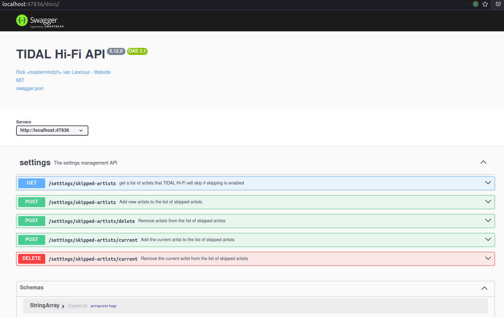
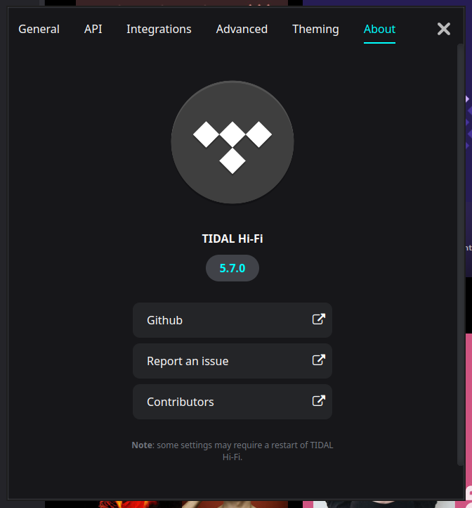
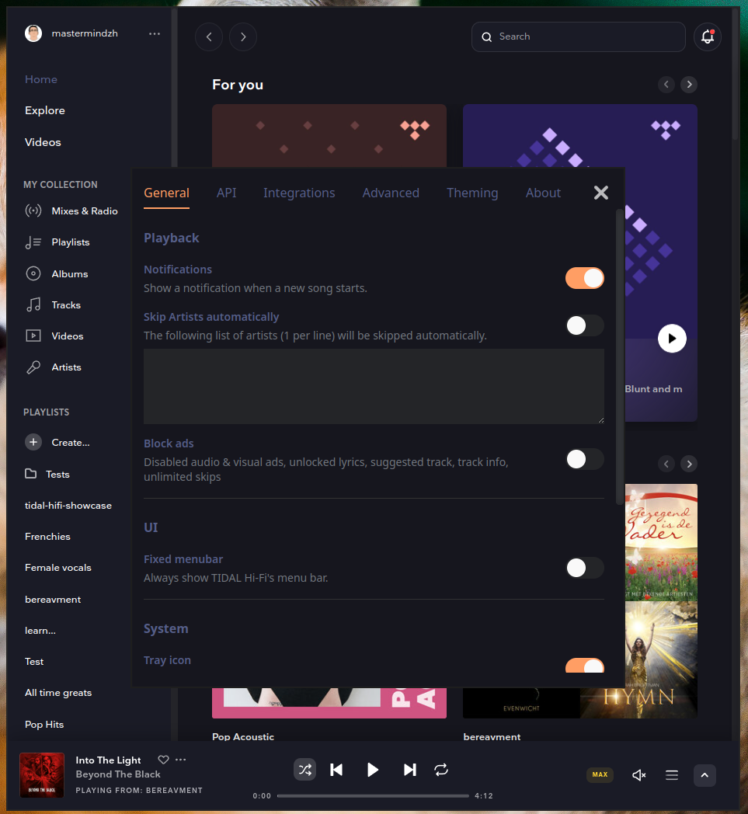

# Changelog

All notable changes to this project will be documented in this file.
The format is based on [Keep a Changelog](https://keepachangelog.com/en/1.0.0/),
and this project adheres to [Semantic Versioning](https://semver.org/spec/v2.0.0.html).

## [6.0.0]

### Breaking Changes

- **Default controller changed to MediaSession Controller**: While this change should not break existing installations (settings are preserved), we've marked this as a breaking change due to the significant shift in the default interaction method with Tidal. If you experience any issues, you can revert to the previous behavior by changing the controller type back to "DOM Controller" in Settings → Advanced → Controller Type.

### Added

- Added [TidalControllers](./docs/tidal-controllers.md)
  - Changed default implementation to `mediaSessionController`
- Implemented a min of 100ms and max of 60000ms on polling intervals
- Switched primary URL from [https://listen.tidal.com](https://listen.tidal.com) to [https://tidal.com](https://tidal.com)
- added `albumArt` key to the API
  - Tidal Hi-Fi now downloads the best quality album art to use in notifications/api/etc
- Option to reset zoom to 100% from settings -> Theming
- Added `/health` endpoint to the API for health checks and monitoring
- Root API endpoint (`/`) now redirects to `/docs` for immediate access to interactive documentation
- Added "Start Minimized" option in Settings → Theming to hide the main window on startup
- Ability to use transparent themes.

### fixes

- pressing delete no longer searches for "Delete" in the song search
  - Now matches tidal.com -> does nothing

fixes [#779](https://github.com/Mastermindzh/tidal-hifi/issues/779)
fixes [#768](https://github.com/Mastermindzh/tidal-hifi/issues/768)
fixes [#717](https://github.com/Mastermindzh/tidal-hifi/issues/717)
fixes [#505](https://github.com/Mastermindzh/tidal-hifi/issues/505)
fixes [#712](https://github.com/Mastermindzh/tidal-hifi/issues/712)
fixes [#750](https://github.com/Mastermindzh/tidal-hifi/issues/750)
fixes [#563](https://github.com/Mastermindzh/tidal-hifi/issues/563)
fixes [#385](https://github.com/Mastermindzh/tidal-hifi/issues/385)
fixes [#443](https://github.com/Mastermindzh/tidal-hifi/issues/443)
fixes [#772](https://github.com/Mastermindzh/tidal-hifi/issues/772)
fixes [#438](https://github.com/Mastermindzh/tidal-hifi/issues/438)

## [5.20.1]

- Updated electron to 37.2.5

## [5.20.0]

- Removes the `--enable-features=UseOzonePlatform` flag, as the Ozone platform has been the default on Linux since Electron 28 and this flag is no longer necessary.
- Adds the `--enable-wayland-ime` flag to enable Input Method Editor (IME) support in Wayland environments, improving the input experience for CJK and other users.
- Updated various dependencies
- Updated Electron to 37, potentially fixing [#580](https://github.com/Mastermindzh/tidal-hifi/issues/580)

## [5.19.0]

- Fixed the issue where media updates would cease to work after album names can't be found
  - Will simply report an empty string when it can't find the album
- Updated various dependencies

## [5.18.2]

- Reverted to sass 1.79.4 to fix `Nix` builds
- Changed electron-builder.base.yml to now generate the correct .desktop entries again
  - Should fix flatpak build

## [5.18.1]

- Fixed the login bug
- Upgraded electron to 35.1.1
- Added Widevine/CDM info to startup
- delayed remote electron initializer

## [5.18.0]

- [Dianoga](https://github.com/Dianoga) fixed the duration selector, restoring mpris & partial API data.
  - PR: #554
- Added `xesam:url` property to mpris metadata fixes [#506](https://github.com/Mastermindzh/tidal-hifi/issues/506)

## [5.17.0]

- Added an option to disable the dynamic title and set it to a static one, [#491](https://github.com/Mastermindzh/tidal-hifi/pull/491)
- Discord integration now says "Listening to" instead of "playing" [#488](https://github.com/Mastermindzh/tidal-hifi/pull/488) && [#454](https://github.com/Mastermindzh/tidal-hifi/pull/454)
- Fixed several element names in the dom scraper
- Removed the Songwhip (they shut down) integration and replaced it with TIDAL's universal link system

## [5.16.0]

- Fix issue #449 Discord RPC stuck on "Browsing Tidal".
- Fix issue #448 Add option to disable the discord rpc idle text
- Notifications are now send at the end of the update process, allowing other events to happen sooner.

## [5.15.0]

- Added all missing swagger/openApi info with the help of [Times-Z](https://github.com/Times-Z)
- Updated most dependency versions

  - This includes Electron 31!

- Added a channel selector so we can now use Tidal's staging environment directly from the app
  - implements [#437](https://github.com/Mastermindzh/tidal-hifi/issues/437)

## [5.14.1]

- Fixed `getAlbumName` not finding album name whilst on queue page
- Added all mediaInfo to mpris interface using the `custom:` prefix

## [5.14]

- Simplified `MediaInfo` & `Options` types
- Added `playingFrom` information to the info API
  - also changed the way we update Album info since Playing From now shows the correct Album.
- API now allows you to set the `hostname` so you can control who can interact with the API.
- Reworked swagger generation hotfix to properly generate `swagger.json` during the compile step
  - Might switch to tsoa in the future, idk yet.
- Added [Tidal Magazine](https://tidal.com/magazine/) integration (in the menubar or use `Ctrl + M`)

## [5.13.1]

- removed Swagger generation step in favor of pre-generated file.
  - This also fixes the API issue [#409](https://github.com/Mastermindzh/tidal-hifi/issues/409)
  - This also stops TIDAL-hifi from scanning your entire home directory... the glob was very broad apparently.

## [5.13.0]

- Fixed [#403](https://github.com/Mastermindzh/tidal-hifi/issues/403) "cannot read shuffle of undefined" error
- Added an API to add & delete entries from the skippedArtists list in the settings. fixes [#405](https://github.com/Mastermindzh/tidal-hifi/issues/405)
  - `GET /settings/skipped-artists` -> get list of skipped artists
  - `POST /settings/skipped-artists` -> add to the list of skipped artists
  - `POST /settings/skipped-artists/delete` -> delete from the list of skipped artists
  - `POST /settings/skipped-artists/current` -> skip the current artist
  - `DELETE /settings/skipped-artists/current` -> delete the current artist from the skip list
  - Added Swagger documentation to the new endpoints:
    
- CORS support added by [Mjokfox](https://github.com/Mjokfox)

## [5.12.0]

- Added Shuffle and Repeat state to API response - By [ThatGravyBoat](https://github.com/ThatGravyBoat)

## [5.11.0]

- Re-implemented the API, added support for duration/current in seconds & shuffle+repeat
  - made the original API "legacy" (still works the same)
  - Now using the correct HTTP verb for all new endpoints
- Implemented TIDAL's universal links. All links are now universal.
- Custom `tidal://` protocol fixed - By [TheRockYT](https://github.com/TheRockYT)
- Global media shortcuts removed since TIDAL includes them by default - By [TheRockYT](https://github.com/TheRockYT)

- Fixes
  - [#390](https://github.com/Mastermindzh/tidal-hifi/issues/390)
  - [#376](https://github.com/Mastermindzh/tidal-hifi/issues/376)
  - [#383](https://github.com/Mastermindzh/tidal-hifi/issues/383)
  - [#393](https://github.com/Mastermindzh/tidal-hifi/issues/393)

## [5.10.0]

- TIDAL will now close the previous notification if a new one is sent whilst the old is still visible. [#364](https://github.com/Mastermindzh/tidal-hifi/pull/364)
- Updated developer documentation to get started in README [#365](https://github.com/Mastermindzh/tidal-hifi/pull/365)
- Links in the about window now open in the user's default browser. fixes [#360](https://github.com/Mastermindzh/tidal-hifi/issues/360)
- Refactored "nowPlaying" code to always display the current state, even when the built-in UI is updated.
  - fixes [#351](https://github.com/Mastermindzh/tidal-hifi/issues/351)
  - fixes [#356](https://github.com/Mastermindzh/tidal-hifi/issues/356)
  - fixes [#370](https://github.com/Mastermindzh/tidal-hifi/issues/370)
- Reverted to using old icon syntax with icons in the build directory. fixes [#350](https://github.com/Mastermindzh/tidal-hifi/issues/350)
- Enabled wayland platform flags by default when launching through .desktop file
  - fixes [#273](https://github.com/Mastermindzh/tidal-hifi/issues/273)
  - fixes [#347](https://github.com/Mastermindzh/tidal-hifi/issues/347)

## [5.9.0]

- More Discord options:
  - Added the ability to hide the current song from the discord activity and display a custom text instead
  - Added the ability to customize the text that is shown when no song is playing
  - Discord now reacts to pausing/unpausing events
- Refactored media info updates so it only updates the required info, fixes #342, #306
- Added 5.9.0 logs/versions/migrations

### Fixed

- Fixed chromium mediaSession instance showing up. fixes #338 #198
- Set a new icon, should fix #302
- Made sure settingsWindow exists before operating on it. fixes #344

## [5.8.0]

- Updated Electron to 28.1.1 (fixes [325](https://github.com/Mastermindzh/tidal-hifi/issues/325))
- Updated dependencies to latest

  - added theme files to stylelint ignore
  - fixed other stylelint errors

- Added functionality to favorite a song (fixes [#323](https://github.com/Mastermindzh/tidal-hifi/issues/323))

  - Added a hotkey to favorite ("Add to collection") songs: Control+a
  - Added the "favorite" field in the `mediaInfo` and the API `/current` endpoint
  - Added an endpoint to toggle favoriting a song: `http://localhost:47836/favorite/toggle`

- Fixed wrong "end time stamp" for currently playing song (fixes [#282](https://github.com/Mastermindzh/tidal-hifi/issues/282))
  - Affected the API + all integrations
  - As requested we also added toggle to sync the timestamps to Discord (default = true)

## [5.7.1]

- Fixed mpris not being set up correctly due to capitalization of the instance name.

## [5.7.0]

- Renamed app to TIDAL Hi-Fi.
- Made sure all windows run with the same web preferences set (compared to main app).
  - Fixes the last.fm bug.
- Added settings to customize the Discord rich presence information
  - Discord settings are now also collapsible like the ListenBrainz ones are
- Restyled settings menu to include version number and useful links on the about page
  
- The ListenBrainz integration has been extended with a configurable (5 seconds by default) delay in song reporting so that it doesn't spam the API when you are cycling through songs.
- Custom CSS now also applies to settings window
  

## [5.6.0]

- Added support for Wayland (on by default) fixes [#262](https://github.com/Mastermindzh/tidal-hifi/issues/262) and [#157](https://github.com/Mastermindzh/tidal-hifi/issues/157)
- Made it clear in the readme that this TIDAL Hi-Fi client supports High & Max audio settings. fixes [#261](https://github.com/Mastermindzh/tidal-hifi/issues/261)
- Added app suspension inhibitors when music is playing. fixes [#257](https://github.com/Mastermindzh/tidal-hifi/issues/257)
- Fixed bug with theme files from user directory trying to load: "an error occurred reading the theme file"
- Fixed: config flags not being set correctly
- [DEV]:
  - Logger is now static and will automatically call either ipcRenderer or ipcMain

## 5.5.0

- ListenBrainz integration added (thanks @Mar0xy)

## 5.4.0

- Removed Windows builds (from publishes) as they don't work anymore.
- Added [Songwhip](https://songwhip.com/) integration
- Fixed bug with several hotkeys not working due to Tidal's HTML/css changes
- [DEV]:
  - added a logger to log into STDout
  - added "watchStart" which will automatically restart electron when it detects a source code change
  - added "listen.tidal.com-parsing-scripts" folder with a script to verify whether all elements (in the main preload.ts) are present on the page

## 5.3.0

- SPKChaosPhoenix updated the beautiful Tokyo Night theme:

## 5.2.0

- moved from Javascript to Typescript for all files

  - use `npm run watch` to watch for changes & recompile typescript and sass files

- Added support for theming the application
- Added drone build file use `drone exec` or drone.ci to build it

## 5.1.0

### New features

- Added proper updates through the MediaSession API
- You can now add custom CSS in the "advanced" settings tab
- You can now configure the updateFrequency in the settings window
  - Default value is set to 500 and will overwrite the hardcoded value of 100

### Fixes

- Any songs **including** an artist listed in the `skipped artists` setting will now be skipped even if the song is a collaboration.
- Linux desktop icons have been fixed. See [#222](https://github.com/Mastermindzh/tidal-hifi/pull/222) for details.

## 5.0.0

- Replaced "muting artists" with a full implementation of an Adblock mechanism

  > Disabled audio & visual ads, unlocked lyrics, suggested track, track info, unlimited skips thanks to uBlockOrigin custom filters ([source](https://github.com/uBlockOrigin/uAssets/issues/17495))

- @thanasistrisp updated Electron to 24.1.2 and fixed the tray bug :)

## 4.4.0

- Updated shortcut hint on the menubar to reflect the new `ctrl+=` shortcut.
- Reverted icon path to `icon.png` instead of the hardcoded linux path.
- Add support to autoHide the menubar and showing it with the `alt` key.
- Move the quit command from the system sub-menu to the main menu
- Added single click focus/show on the tray icon
  - Doesn't work on all platforms. Nothing I can do about that unfortunately!
- Added a list of artists to automatically skip.
  - I don't like the vast majority of dutch music so I added one of them to my list to test: [./docs/no-dutch-music.mp4](./docs/no-dutch-music.mp4)

## 4.3.1

- fix: App always requests a default-url-handler-scheme change on start

## 4.3.0

- Added a setting to disable background throttling ([docs](https://www.electronjs.org/docs/latest/api/browser-window))

## 4.2.0

- New settings window by BlueManCZ
- Fixed the desktop files in electron-builder
  - icon is set to new static path based on Arch/Debian
  - Name has changed to TIDAL Hi-Fi

## 4.1.2

- Changed the category of the desktop file to AudioVideo
- Changed desktop file name to "TIDAL Hi-Fi"

## 4.1.1

- Fixed `cannot read property of undefined` error because of not passing mainWindow around.
- vincens2005, fixed inconsistent auto muting

## 4.1.0

- Added `tidal://` protocol support
- Switched icon strategies to fix bugs with icons
- Fixed tray icon bugs
  - Menu now shows in KDE as well
  - Toggle window is supported from tray icon
  - regular click is still ignored, see [this issue](https://github.com/electron/electron/issues/6773)
- Fixed about tab not showing
- Fixed playback, mpris and API issues

## 4.0.1

- Updated build config to make use of a base file that doesn't build anything.
  - This fixes the issue of unwanted extra build targets that were introduced with the electron-builder update

## 4.0.0

- Updated to Electron 19.0.5

## 3.1.1

- Media update timeout set to 500 instead of 200
- Updated property name for duration because of a tidal update
- flag for "disable hardware media keys" now working again

## 3.1.0

- Added a separate advanced options settings panel with flags
  - Added gpu-rasterization flag
- config setting `disableHardwareMediaKeys` moved to `flags.disableHardwareMediaKeys`, it will be migrated automatically

## 3.0.0

- Updated to Electron 15
- Fixed the develop "build-unpacked" command
- Added setting to disable multiple TIDAL Hi-Fi windows (defaults to true)
- Added setting to disable HardwareMediaKeyHandling (defaults to false)

## 2.8.2

- Updated dependencies
- Downgraded packaged version of electron to 8.5.2, doesn't seem to like a newer build
- Fixed the annoying (and useless) terminal warning about `allowRendererProcessReuse`

## 2.8.1

- Mar0xy fixed some build issues (thanks!)
- vincens2005 fixed the quit button in the menubar

## 2.8.0

- Added the ability to mute artists automatically
- Added better error handling for discord rpc

## 2.7.2

- Disabled sandboxing to fix a display compositor issue on Linux.

## 2.7.1

- Fixed bug: Triggering full screen from the Tidal web app would cause the menubar to be visible even if it was disabled in the settings

## 2.7.0

- Switched to the native Notifier (removed node-notifier)
- Album art now also has a name, based on [best effort](https://github.com/Mastermindzh/tidal-hifi/pull/88#pullrequestreview-840814847)

## 2.6.0

- Add album images to media info and discord

## 2.5.0

- Notify-send now correctly shows "Tidal Hi-Fi" as the program name
- Updated dependencies (including electron itself)

### known issues

- Requires older version of nodejs due to electron-builder (use lts/gallium)

### builds

updated to nodejs 16 in actions

## 2.4.0

- Added more MPRIS settings
- Added instruction for rescrobbler to get last.fm working without sandbox mode

## 2.3.0

- Added a setting to minimize to tray on app close (off by default)
- Added the main menu to the tray icon

## 2.2.1

- artists is now gotten specifically from the footer. This fixes the [unknown artists bug](https://github.com/Mastermindzh/tidal-hifi/issues/45).
- the discord module will check whether the artists is empty and if so substitute it with a default message. This is to prevent sending an empty state to Discord (which it doesn't support). fixes [#45](https://github.com/Mastermindzh/tidal-hifi/issues/54)

### removed arch build details from source control

moved to: [https://github.com/Mastermindzh/tidal-hifi-aur](https://github.com/Mastermindzh/tidal-hifi-aur)

## 2.2.0

- The discord integration now adds a time remaining field based on the song duration
- All fields (current, remaining, and url are also available in the API\*)
- the artist field is now correctly identified

\* current time only updates on play/pause.

## 2.1.1

- The discord integration now doesn't send an update every 15 seconds it sends an update whenever the media info changes
- consolidated updating the media info changes with the status changes into a single global event

## 2.1.0

- [Mar0xy](https://github.com/Mar0xy) added Discord integration.
- Several versions have been bumped to fix vulnerabilities

## 2.0.0

### Breaking changes

- Changed settings hotkey from "ctrl+/" to "ctrl+=" to avoid a conflict with the default Tidal hotkeys

## Other changes

- Added a setting to disable custom hotkeys
- Fixed the bug that the previous song hotkey would register 3 times. (Twice due to a duplicate block of code + once from the default tidal hotkey)

## 1.3.0

-- re-enabled MPRIS-service wit the electron downloader fixes

## 1.2.0

- Added the ability to disable the tray icon

## 1.1.1

Bugfixes:

- Arch AUR install failed before, it is fixed now by using the included build scripts

## 1.1.0

- updated to electron 8.0.0
- Added a beta-version of the MPRIS service

- Bugfixes:
  - icon on gnome not showing in launcher
  - app not remembering size on startup
