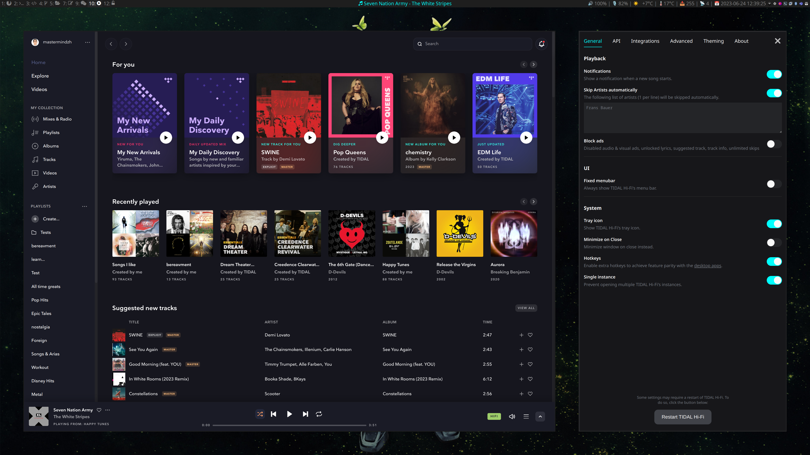

# Changelog

All notable changes to this project will be documented in this file.
The format is based on [Keep a Changelog](https://keepachangelog.com/en/1.0.0/),
and this project adheres to [Semantic Versioning](https://semver.org/spec/v2.0.0.html).

## [5.6.0]

- Added support for Wayland (on by default) fixes [#262](https://github.com/Mastermindzh/tidal-hifi/issues/262) and [#157](https://github.com/Mastermindzh/tidal-hifi/issues/157)
- Made it clear in the readme that this tidal-hifi client supports High & Max audio settings. fixes [#261](https://github.com/Mastermindzh/tidal-hifi/issues/261)
- Added app suspension inhibitors when music is playing. fixes [#257](https://github.com/Mastermindzh/tidal-hifi/issues/257)
- Fixed bug with theme files from user directory trying to load: "an error occurred reading the theme file"
- Fixed: config flags not being set correctly
- [DEV]:
  - Logger is now static and will automatically call either ipcRenderer or ipcMain

## 5.5.0

- ListenBrainz integration added (thanks @Mar0xy)

## 5.4.0

- Removed Windows builds (from publishes) as they don't work anymore.
- Added [Songwhip](https://songwhip.com/) integration
- Fixed bug with several hotkeys not working due to Tidal's HTML/css changes
- [DEV]:
  - added a logger to log into STDout
  - added "watchStart" which will automatically restart electron when it detects a source code change
  - added "listen.tidal.com-parsing-scripts" folder with a script to verify whether all elements (in the main preload.ts) are present on the page

## 5.3.0

- SPKChaosPhoenix updated the beautiful Tokyo Night theme:

## 5.2.0

- moved from Javascript to Typescript for all files

  - use `npm run watch` to watch for changes & recompile typescript and sass files

- Added support for theming the application
- Added drone build file use `drone exec` or drone.ci to build it

## 5.1.0

### New features

- Added proper updates through the MediaSession API
- You can now add custom CSS in the "advanced" settings tab
- You can now configure the updateFrequency in the settings window
  - Default value is set to 500 and will overwrite the hardcoded value of 100

### Fixes

- Any songs **including** an artist listed in the `skipped artists` setting will now be skipped even if the song is a collaboration.
- Linux desktop icons have been fixed. See [#222](https://github.com/Mastermindzh/tidal-hifi/pull/222) for details.

## 5.0.0

- Replaced "muting artists" with a full implementation of an Adblock mechanism

  > Disabled audio & visual ads, unlocked lyrics, suggested track, track info, unlimited skips thanks to uBlockOrigin custom filters ([source](https://github.com/uBlockOrigin/uAssets/issues/17495))

- @thanasistrisp updated Electron to 24.1.2 and fixed the tray bug :)

## 4.4.0

- Updated shortcut hint on the menubar to reflect the new `ctrl+=` shortcut.
- Reverted icon path to `icon.png` instead of the hardcoded linux path.
- Add support to autoHide the menubar and showing it with the `alt` key.
- Move the quit command from the system sub-menu to the main menu
- Added single click focus/show on the tray icon
  - Doesn't work on all platforms. Nothing I can do about that unfortunately!
- Added a list of artists to automatically skip.
  - I don't like the vast majority of dutch music so I added one of them to my list to test: [./docs/no-dutch-music.mp4](./docs/no-dutch-music.mp4)

## 4.3.1

- fix: App always requests a default-url-handler-scheme change on start

## 4.3.0

- Added a setting to disable background throttling ([docs](https://www.electronjs.org/docs/latest/api/browser-window))

## 4.2.0

- New settings window by BlueManCZ
- Fixed the desktop files in electron-builder
  - icon is set to new static path based on Arch/Debian
  - Name has changed to Tidal-Hifi

## 4.1.2

- Changed the category of the desktop file to AudioVideo
- Changed desktop file name to "TIDAL Hi-Fi"

## 4.1.1

- Fixed `cannot read property of undefined` error because of not passing mainWindow around.
- vincens2005, fixed inconsistent auto muting

## 4.1.0

- Added `tidal://` protocol support
- Switched icon strategies to fix bugs with icons
- Fixed tray icon bugs
  - Menu now shows in KDE as well
  - Toggle window is supported from tray icon
  - regular click is still ignored, see [this issue](https://github.com/electron/electron/issues/6773)
- Fixed about tab not showing
- Fixed playback, mpris and API issues

## 4.0.1

- Updated build config to make use of a base file that doesn't build anything.
  - This fixes the issue of unwanted extra build targets that were introduced with the electron-builder update

## 4.0.0

- Updated to Electron 19.0.5

## 3.1.1

- Media update timeout set to 500 instead of 200
- Updated property name for duration because of a tidal update
- flag for "disable hardware media keys" now working again

## 3.1.0

- Added a separate advanced options settings panel with flags
  - Added gpu-rasterization flag
- config setting `disableHardwareMediaKeys` moved to `flags.disableHardwareMediaKeys`, it will be migrated automatically

## 3.0.0

- Updated to Electron 15
- Fixed the develop "build-unpacked" command
- Added setting to disable multiple tidal-hifi windows (defaults to true)
- Added setting to disable HardwareMediaKeyHandling (defaults to false)

## 2.8.2

- Updated dependencies
- Downgraded packaged version of electron to 8.5.2, doesn't seem to like a newer build
- Fixed the annoying (and useless) terminal warning about `allowRendererProcessReuse`

## 2.8.1

- Mar0xy fixed some build issues (thanks!)
- vincens2005 fixed the quit button in the menubar

## 2.8.0

- Added the ability to mute artists automatically
- Added better error handling for discord rpc

## 2.7.2

- Disabled sandboxing to fix a display compositor issue on Linux.

## 2.7.1

- Fixed bug: Triggering full screen from the Tidal web app would cause the menubar to be visible even if it was disabled in the settings

## 2.7.0

- Switched to the native Notifier (removed node-notifier)
- Album art now also has a name, based on [best effort](https://github.com/Mastermindzh/tidal-hifi/pull/88#pullrequestreview-840814847)

## 2.6.0

- Add album images to media info and discord

## 2.5.0

- Notify-send now correctly shows "Tidal HiFi" as the program name
- Updated dependencies (including electron itself)

### known issues

- Requires older version of nodejs due to electron-builder (use lts/gallium)

### builds

updated to nodejs 16 in actions

## 2.4.0

- Added more MPRIS settings
- Added instruction for rescrobbler to get last.fm working without sandbox mode

## 2.3.0

- Added a setting to minimize to tray on app close (off by default)
- Added the main menu to the tray icon

## 2.2.1

- artists is now gotten specifically from the footer. This fixes the [unknown artists bug](https://github.com/Mastermindzh/tidal-hifi/issues/45).
- the discord module will check whether the artists is empty and if so substitute it with a default message. This is to prevent sending an empty state to Discord (which it doesn't support). fixes [#45](https://github.com/Mastermindzh/tidal-hifi/issues/54)

### removed arch build details from source control

moved to: [https://github.com/Mastermindzh/tidal-hifi-aur](https://github.com/Mastermindzh/tidal-hifi-aur)

## 2.2.0

- The discord integration now adds a time remaining field based on the song duration
- All fields (current, remaining, and url are also available in the API\*)
- the artist field is now correctly identified

\* current time only updates on play/pause.

## 2.1.1

- The discord integration now doesn't send an update every 15 seconds it sends an update whenever the media info changes
- consolidated updating the media info changes with the status changes into a single global event

## 2.1.0

- [Mar0xy](https://github.com/Mar0xy) added Discord integration.
- Several versions have been bumped to fix vulnerabilities

## 2.0.0

### Breaking changes

- Changed settings hotkey from "ctrl+/" to "ctrl+=" to avoid a conflict with the default Tidal hotkeys

## Other changes

- Added a setting to disable custom hotkeys
- Fixed the bug that the previous song hotkey would register 3 times. (Twice due to a duplicate block of code + once from the default tidal hotkey)

## 1.3.0

-- re-enabled MPRIS-service wit the electron downloader fixes

## 1.2.0

- Added the ability to disable the tray icon

## 1.1.1

Bugfixes:

- Arch AUR install failed before, it is fixed now by using the included build scripts

## 1.1.0

- updated to electron 8.0.0
- Added a beta-version of the MPRIS service

- Bugfixes:
  - icon on gnome not showing in launcher
  - app not remembering size on startup
