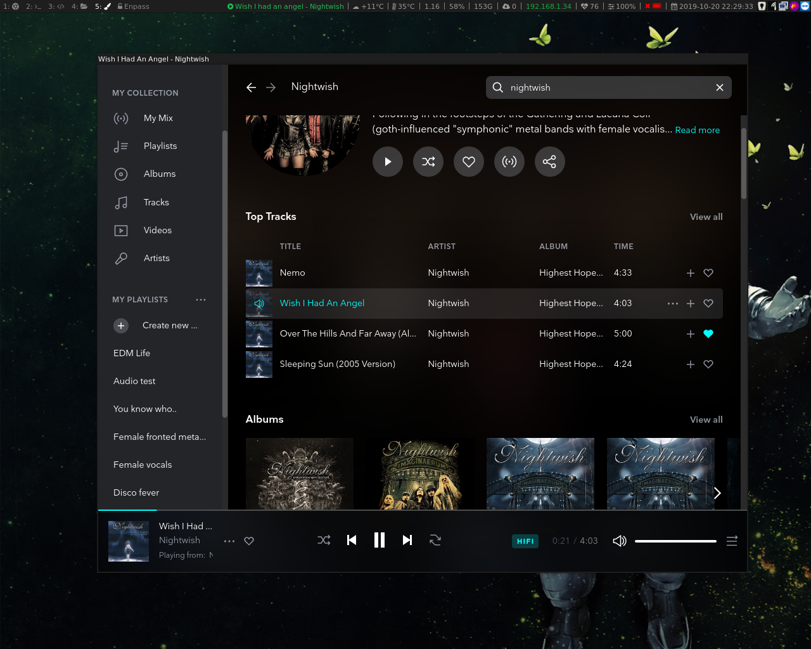
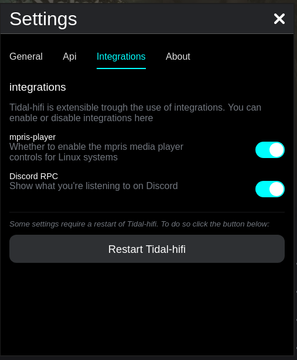
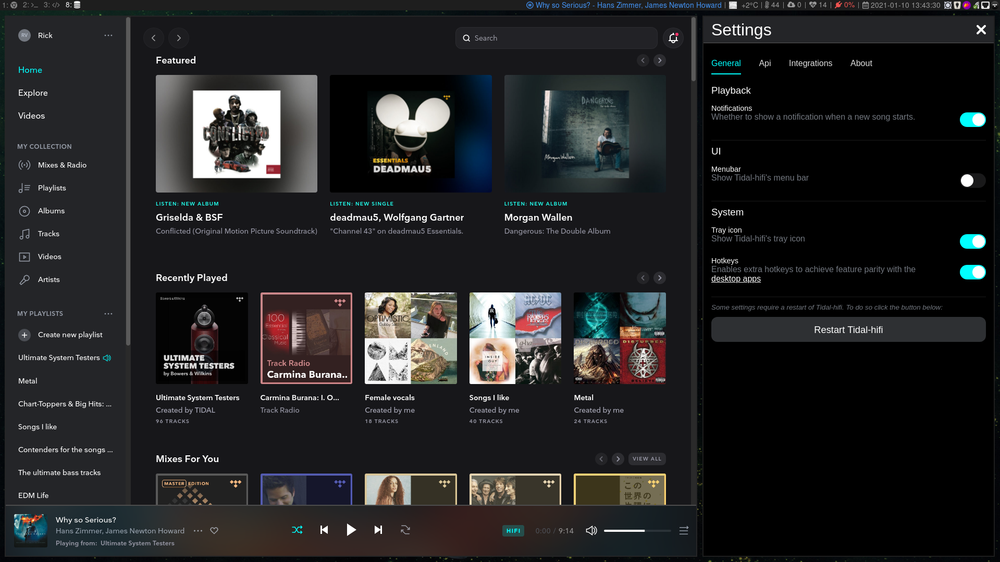

<h1>
Tidal-hifi

</h1>

The web version of [listen.tidal.com](https://listen.tidal.com) running in electron with hifi support thanks to widevine.



## Table of contents

<!-- toc -->

- [Installation](#installation)
  * [Using releases](#using-releases)
  * [Snap](#snap)
  * [Arch Linux](#arch-linux)
  * [Flatpak](#flatpak)
  * [Nix](#nix)
  * [Using source](#using-source)
- [Features](#features)
- [Integrations](#integrations)
  * [Known bugs](#known-bugs)
    + [last.fm doesn't work out of the box. Use rescrobbler as a workaround](#lastfm-doesnt-work-out-of-the-box-use-rescrobbler-as-a-workaround)
- [Why](#why)
- [Why not extend existing projects?](#why-not-extend-existing-projects)
- [Special thanks to...](#special-thanks-to)
- [Buy me a coffee? Please don't](#buy-me-a-coffee-please-dont)
- [Images](#images)
  * [Settings window](#settings-window)
  * [User setups](#user-setups)

<!-- tocstop -->

## Installation

### Using releases

Various packaged versions of the software are available on the [releases](https://github.com/Mastermindzh/tidal-hifi/releases) tab.

### Snap

To install with `snap` you need to download the pre-packaged snap-package from this repository, found under releases:

1. Download

```sh
wget <URI> #for instance: https://github.com/Mastermindzh/tidal-hifi/releases/download/1.0/tidal-hifi_1.0.0_amd64.snap
```

2. Install

```sh
snap install --dangerous <path> #for instance: tidal-hifi_1.0.0_amd64.snap
```

### Arch Linux

Arch Linux users can use the AUR to install tidal-hifi:

```sh
trizen tidal-hifi-bin
```

### Flatpak

To install via [Flatpak](https://flathub.org/apps/details/com.mastermindzh.tidal-hifi) run the following command:

```sh
flatpak install flathub com.mastermindzh.tidal-hifi
```

### Nix

To install with Nix run the following command:

```sh
nix-env -iA nixpkgs.tidal-hifi
```

### Using source

To install and work with the code on this project follow these steps:

- git clone [https://github.com/Mastermindzh/tidal-hifi.git](https://github.com/Mastermindzh/tidal-hifi.git)
- cd tidal-hifi
- npm install
- npm start

## Features

- HiFi playback
- Notifications
- Custom hotkeys ([source](https://defkey.com/tidal-desktop-shortcuts))
- API for status and playback
- [Mute artists automatically (defaults to "Tidal")]("./docs/muting-artists.md")
- Custom [integrations](#integrations)
- [Settings feature](./docs/settings.png) to disable certain functionality. (`ctrl+=` or `ctrl+0`)
- AlbumArt in integrations ([best-effort](https://github.com/Mastermindzh/tidal-hifi/pull/88#pullrequestreview-840814847))

## Integrations

Tidal-hifi comes with several integrations out of the box.
You can find these in the settings menu (`ctrl + =` by default) under the "integrations" tab.



It currently includes:

- MPRIS - MPRIS media player controls/status
- Discord - Shows what you're listening to on Discord.

Not included:

- [i3 blocks config](https://github.com/Mastermindzh/dotfiles/commit/9714b2fa1d670108ce811d5511fd3b7a43180647) - My dotfiles where I use this app to fetch currently playing music (direct commit)

### Known bugs

#### last.fm doesn't work out of the box. Use rescrobbler as a workaround

The last.fm login doesn't work, as is evident from the following issue: [Last.fm login doesn't work](https://github.com/Mastermindzh/tidal-hifi/issues/4).
However, in that same issue you can read about a workaround using [rescrobbler](https://github.com/InputUsername/rescrobbled).
For now that will be the default workaround.

## Why

I moved from Spotify over to Tidal and found Linux support to be lacking.

When I started this project there weren't any Linux apps that offered Tidal's "hifi" options nor any scripts to control it.

## Why not extend existing projects?

Whilst there are a handful of projects attempting to run Tidal on Electron they are all unappealing to me because of various reasons:

- Lack of a maintainers/developers. (no hotfixes, no issues being handled etc)
- Most are simple web wrappers, not my cup of tea.
- Some are DE oriented. I want this to work on WM's too.
- None have widevine working at the moment

Sometimes it's just easier to start over, cover my own needs and then making it available to the public :)

## Special thanks to...

- [Castlabs](https://castlabs.com/)
  For maintaining Electron with Widevine CDM installation, Verified Media Path (VMP), and persistent licenses (StorageID)

## Buy me a coffee? Please don't

Instead spend some money on a charity I care for: [kwf.nl](https://www.kwf.nl/donatie/donation).
Inspired by [haydenjames' issue](https://github.com/Mastermindzh/tidal-hifi/issues/27#issuecomment-704198429)

## Images

### Settings window



### User setups

Some of our users are kind enough to share their usage pictures.
If you want to see them or possibly even add one please do so in the following issue: [#3 - image thread](https://github.com/Mastermindzh/tidal-hifi/issues/3).
