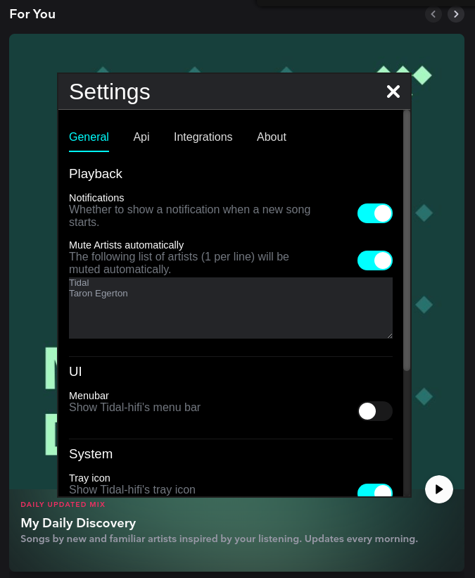

# Muting artists

If you feel that some of your music is embarrassing for others you can mute specific artists in the settings window.
This functionality is inspired by the [adblock ticket](https://github.com/Mastermindzh/tidal-hifi/issues/112), and whilst I personally feel you should simply buy Tidal, I also believe in muting sound that you don't want to hear.

Anyway, to block an artist, open the settings window (see image below) and enter a list of artists in the textarea as seen below.
Don't forget to turn the feature on and Tidal-hifi will automatically mute the player whenever that artist is playing.

This will allow you to skip the song without anyone noticing. (you can always say "no idea, it seems to have no audio").

